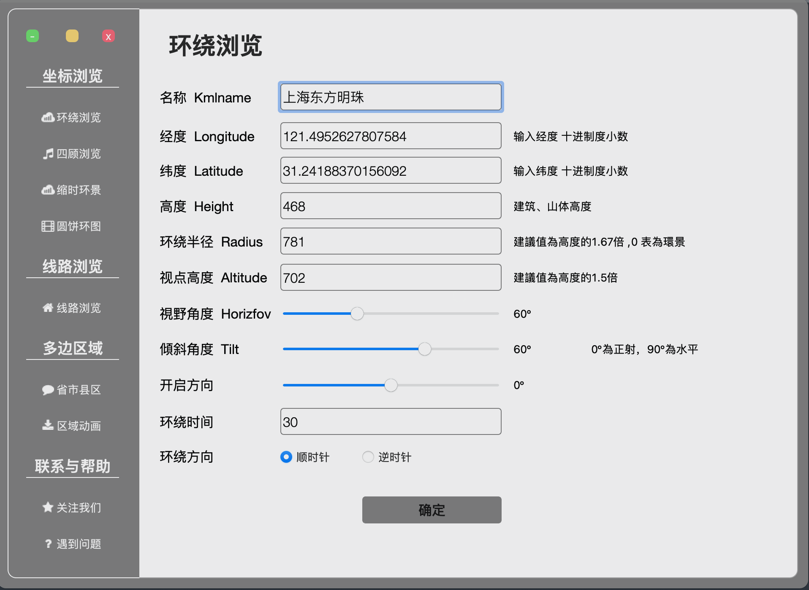

# Google Earth 地图动画生成器

本程序写给：自驾旅行、地理爱好者、历史地图爱好者

我的B站账号：https://space.bilibili.com/153276950

#### 一、KML generater 

- 运行
    ```
    安装python环境后，请运行
    pip install -r requestments.txt
    python main.py
    ```
- 打包
	```
	pyinstaller --windowed --onefile --key '123456789' --icon=image/logo.ico --clean --noconfirm main.py
	```

#### 二、功能介绍



- **坐标浏览：**

  [环绕浏览](https://www.bilibili.com/video/BV1Ga411f7Yn)：生成在自定义高度，环绕一周观察某一建筑、山体等动画

  四顾浏览：生成在自定义高度，观察周围一周的建筑、山体等自然景观的动画

  [缩时环景](https://www.bilibili.com/video/BV13V4y197iR)：生成当天太阳的日出、日中、日落；晚上都转星移的动画

  [圆饼环图](https://www.bilibili.com/video/BV1A44y1d7Ky)：以某一坐标为原点，生成圆形、环形、饼形的地图

- **线路浏览**: 生成线路的生长动画，动画中支持[模型](https://www.bilibili.com/video/BV1Sh4y1J7hU)与图片的移动

  | 路线类型 | 视角类型 | 类型支持       | 
  | -------- | -------- | -------------- | 
  | 生长路线 | 固定视角 | 图片/模型(dae) |   
  | 生长路线 | 环绕视角 | 图片/模型(dae) |   
  | 生长路线 | 跟随视角 | 图片/模型(dae) |   
  | ...         |    ...      |      ...          |     

- **多边形区域**

  省市县区: 生成国界、省界、市区、区县的地图；区域可选是否包含子区域，是否填充颜色等

  [区域渐显](https://www.bilibili.com/video/BV1124y1c7DJ): 生成一个或多个polygon图形逐渐显示的地图动画，颜色、透明度与单个polygon线上时间均能自定义

  [形状变化](https://www.bilibili.com/video/BV1Rz4y1Y7Ys): 支持生成一个或多个polygon图形逐渐显示的地图动画


#### 三、迭代记录

```
2022-11-29：新增动态浏览模块，包括四顾浏览和环绕浏览功能。
2022-12-31：新增圆形、环形和饼图的生成功能。
2023-01-01：新增生长路线模块，包括固定视角、环绕视角和跟随视角的生长路线功能。
2023-01-12：新增省市县区下载功能，支持轮廓和填充颜色。
2023-01-14：修复多边形区域选择中国、包含子区域、颜色填充下载失败的问题。
2023-01-21：修复选择中国时，子区域不包含在内，颜色填充包含的bug。
2023-01-31：修复Windows版本无法安装的问题。
2023-02-19：增加缩时浏览功能（展示24小时太阳的变化）。
2023-03-19：修复缩时浏览生成动画播放逻辑混乱的问题。
2023-04-22：新增区域渐显功能。
2023-05-01：新增区域形状的动态演化功能。
2023-05-29：新增线路浏览（生长路线-跟随视角）功能，支持模型移动，并优化了kml文件的大小。
2023-06-20：功能迭代-区域动画的区域渐显功能增加颜色选择器与颜色透明度功能
```

#### 四、其他提示

- 本生成器生成的地图动画仅支持Google Earth; 
-  [B站教程](https://space.bilibili.com/153276950) 与QQ群号: 708329713
- 本着互联网的开源精神，本生成器为开源免费的软件
- 本生成器仅仅供学习交流使用，请遵守当地法律法规

#### 五、相关问题

- 你进行导入kml文件，选填相应配置后，点击下载桌面会生成kmlfile文件夹将其内的kml文件拖入谷歌地图即可

    ```
    Windows：C:\Users\用户名\Desktop\kmlfile
    Mac：    /Users/用户名/Desktop/kmlfile
    ```

- 如找不到桌面kmlfile文件夹，请查找以下目录:

    ```
    原因：可能是由于你修改系统盘的位置不到kmlfile文件夹
    方案一：在以下目录查找 C:\Users\Administrator\Desktop\kmlfile
    方案二：利用Everything软件搜索一下kmlfile文件夹 
    ```

- 线路浏览动画相关:

    线路浏览动画的模型的移动：请在kmlfile目录下创建一个名为"mode"的文件夹，并将你的dae文件命名为"car.dae" 即可

    测试奥迪模型由零拾ZeroTen提供，感谢零拾ZeroTen

